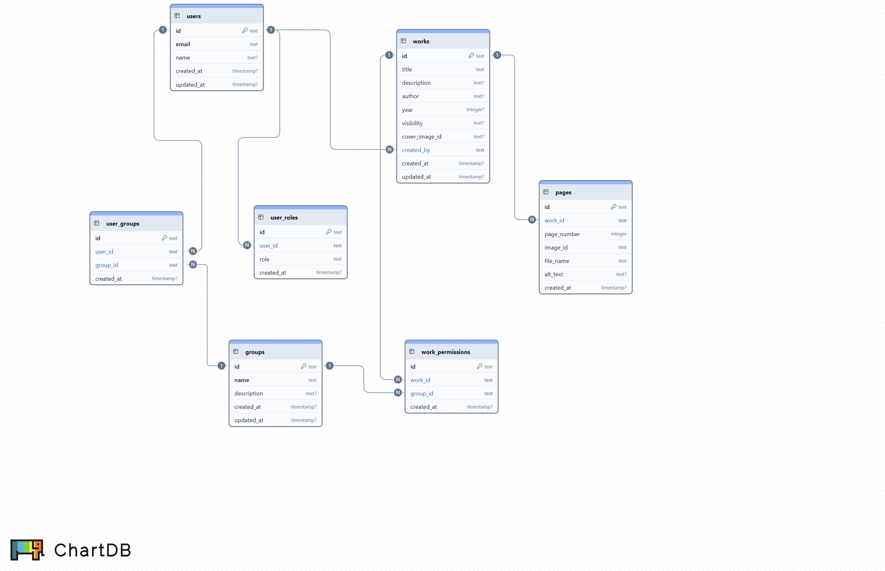

# データベース設計

## 概要



漫画研究会ホームページのデータベース設計ドキュメント。

- **データベース**: Cloudflare D1
- **ORM/マイグレーションツール**: Wrangler CLI
- **スキーマ定義**: `db/migrations/0001_initial_schema.sql`
- **ID生成方式**: UUID v7（時系列ソート可能、推測困難、アプリケーション側で生成）

## システムの想定規模

| データ | ベース | 年間増加 | 10年後 |
|--------|--------|---------|--------|
| ユーザー数 | 30人 | 10人 | 100人 |
| 作品数 | 60作品 | 2作品 | 80作品 |
| ページ数 | 1,200ページ | 40ページ | 1,600ページ |
| グループ数 | 5-10個 | 1-2個 | 15-20個 |

## ディレクトリ構成

```
db/
├── README.md              # このファイル
└── migrations/            # マイグレーションファイル
    └── 0001_initial_schema.sql  # 初期スキーマ
```

## テーブル構成

### 1. `users` - ユーザーテーブル
- **説明**: システムユーザーの基本情報
- **想定レコード数**: 30-100件

| カラム | 型 | 説明 |
|--------|-----|------|
| id | TEXT | ユーザーID（主キー） |
| email | TEXT | メールアドレス（一意） |
| name | TEXT | ユーザー名 |
| created_at | DATETIME | 作成日時 |
| updated_at | DATETIME | 更新日時 |

### 2. `user_roles` - ユーザーロールテーブル
- **説明**: ユーザーの所属ステータス + 管理者フラグ（1ユーザー = 1レコード）
- **想定レコード数**: 30-100件

| カラム | 型 | 説明 |
|--------|-----|------|
| id | TEXT | ロールID（主キー） |
| user_id | TEXT | ユーザーID（外部キー、一意） |
| is_admin | BOOLEAN | 管理者権限フラグ（デフォルト: FALSE） |
| member_type | TEXT | 所属ステータス（member/ob_og/guest） |
| created_at | DATETIME | 作成日時 |

**所属ステータスの種類**:
- `member`: 現役部員
- `ob_og`: OB/OG（卒業生）
- `guest`: ゲスト（公開作品のみ閲覧可能）

**管理者権限**:
- `is_admin = TRUE`: 全作品閲覧可能、管理画面アクセス可能
- 管理者は member_type と独立して設定可能（例: Admin+Member, Admin+OB_OG）

### 3. `groups` - グループテーブル
- **説明**: 所属集まりの情報
- **想定レコード数**: 5-20件

| カラム | 型 | 説明 |
|--------|-----|------|
| id | TEXT | グループID（主キー） |
| name | TEXT | グループ名（一意） |
| description | TEXT | グループ説明 |
| created_at | DATETIME | 作成日時 |
| updated_at | DATETIME | 更新日時 |

**グループ例**:
- `2024年度生`, `2025年度生`（年度別）
- `編集部`, `イラスト班`（役職別）
- `OB/OG会`（卒業生グループ）

### 4. `user_groups` - ユーザーグループ所属テーブル
- **説明**: ユーザーとグループの多対多関係
- **想定レコード数**: 100-300件

| カラム | 型 | 説明 |
|--------|-----|------|
| id | TEXT | 所属ID（主キー） |
| user_id | TEXT | ユーザーID（外部キー） |
| group_id | TEXT | グループID（外部キー） |
| created_at | DATETIME | 作成日時 |

### 5. `works` - 作品テーブル
- **説明**: 漫画作品のメタデータ
- **想定レコード数**: 60-80件

| カラム | 型 | 説明 |
|--------|-----|------|
| id | TEXT | 作品ID（主キー） |
| title | TEXT | 作品タイトル |
| description | TEXT | 作品説明 |
| author | TEXT | 作品の作者名 |
| year | INTEGER | 発行年（4桁の年のみ許可: 1000-9999） |
| visibility | TEXT | 公開設定（public/private/limited） |
| cover_image_id | TEXT | 表紙画像のCloudflare Images ID |
| created_by | TEXT | アップロードした管理者のユーザーID（外部キー、ON DELETE RESTRICT） |
| created_at | DATETIME | 作成日時 |
| updated_at | DATETIME | 更新日時 |

**注意**: `created_by` は ON DELETE RESTRICT により、作品が存在する限りユーザー削除不可

**公開設定の種類**:
- `public`: 一般公開（誰でも閲覧可能）
- `private`: 非公開（管理者のみ閲覧可能）
- `limited`: 限定公開（特定グループのみ閲覧可能）

### 6. `pages` - ページテーブル
- **説明**: 各作品のページ情報
- **想定レコード数**: 1,200-1,600件

| カラム | 型 | 説明 |
|--------|-----|------|
| id | TEXT | ページID（主キー） |
| work_id | TEXT | 作品ID（外部キー） |
| page_number | INTEGER | ページ順序（0始まり） |
| image_id | TEXT | Cloudflare Images ID（NULL=アップロード失敗/未完了） |
| file_name | TEXT | 元のファイル名（NULL=アップロード失敗/未完了） |
| alt_text | TEXT | 代替テキスト（アクセシビリティ） |
| created_at | DATETIME | 作成日時 |

**注意**: `image_id` と `file_name` は NULL 許容。アップロード失敗したページを検知できる。

### 7. `work_permissions` - 作品閲覧権限テーブル
- **説明**: limited作品の閲覧可能グループ
- **想定レコード数**: 50-100件

| カラム | 型 | 説明 |
|--------|-----|------|
| id | TEXT | 権限ID（主キー） |
| work_id | TEXT | 作品ID（外部キー） |
| group_id | TEXT | グループID（外部キー） |
| created_at | DATETIME | 作成日時 |

## インデックス戦略

**超小規模システムのため、インデックスは作成しない**

- データ量が少なくフルスキャンでも十分高速（数ミリ秒以内）
- インデックスのメンテナンスコストの方が高い
- 必要に応じて将来的にKVキャッシュで対応

## マイグレーション

### マイグレーション命名規則

```
NNNN_description.sql
```

- `NNNN`: 4桁の連番（0001, 0002, ...）
- `description`: マイグレーション内容の簡潔な説明（スネークケース）

### ローカル開発環境

```bash
# D1データベースを作成
wrangler d1 create yamadai-manken-db

# マイグレーション実行
wrangler d1 migrations apply yamadai-manken-db --local

# データベースの状態確認
wrangler d1 execute yamadai-manken-db --local --command "SELECT name FROM sqlite_master WHERE type='table';"
```

### 本番環境

```bash
# マイグレーション実行
wrangler d1 migrations apply yamadai-manken-db --remote

# データベースの状態確認
wrangler d1 execute yamadai-manken-db --remote --command "SELECT name FROM sqlite_master WHERE type='table';"
```

## 権限チェックの仕組み

### is_admin（管理者権限）と member_type（所属ステータス）
- **1ユーザー = 1レコード**（`user_roles.user_id` は UNIQUE）
- **is_admin = TRUE** → 全作品閲覧可能、管理画面アクセス可能
- **member_type** → 所属ステータス（member / ob_og / guest）

### group（所属集まり）による制御
- **1ユーザー = 複数グループ可能**
- `limited`作品は`work_permissions`テーブルで閲覧可能グループを管理

### 閲覧権限の判定フロー

```
1. 作品の`visibility`を確認
   ├─ `public` → 誰でも閲覧可能
   ├─ `private` → 管理者のみ閲覧可能
   └─ `limited` → 以下のチェック

2. ユーザーの`is_admin`を確認
   └─ `is_admin = TRUE` → 閲覧可能（特権）

3. ユーザーの所属グループを確認
   └─ `work_permissions`で許可されたグループに所属 → 閲覧可能
```

## データの役割分担

| データ | 保存先 | TTL | 説明 |
|--------|--------|-----|------|
| ユーザー情報 | D1 `users` | - | メールアドレス、名前 |
| ユーザーロール | D1 `user_roles` | - | 1ユーザー = 1ロール |
| グループ情報 | D1 `groups` | - | グループ名、説明 |
| ユーザーグループ所属 | D1 `user_groups` | - | 多対多関係 |
| 作品メタデータ | D1 `works` | - | タイトル、作者、説明、公開設定 |
| ページ情報 | D1 `pages` | - | ページ順序、画像ID |
| 作品閲覧権限 | D1 `work_permissions` | - | グループベースの閲覧制御 |
| JWT公開鍵 | KV `AUTH` | 永続 | 認証用 |
| セッション | KV `AUTH` | 24時間 | ログイン状態管理 |
| OAuthステート | KV `AUTH` | 10分 | OAuth2認証フロー |
| 公開作品一覧キャッシュ | KV `CACHE` | 5分 | 一般向けページ高速化 |
| 作品詳細キャッシュ | KV `CACHE` | 10分 | 作品閲覧ページ高速化 |
| 画像ファイル | Cloudflare Images | - | 画像本体、サムネイル |

## 注意事項

### マイグレーション実行時
1. **マイグレーションファイルは削除・変更しない**
   - 一度適用したマイグレーションは変更せず、新しいマイグレーションで対応

2. **本番環境でマイグレーション実行前に必ずバックアップ**
   ```bash
   # D1のバックアップは自動で取られるが、念のため確認
   wrangler d1 info yamadai-manken-db
   ```

3. **`CREATE TABLE IF NOT EXISTS` を使用**
   - 複数回実行してもエラーにならないように

### トリガー
1. **updated_at の自動更新**
   - `users`, `groups`, `works` テーブルの更新時に `updated_at` を自動設定
   - TRIGGER を使用して DB 側で完結

### データ設計
1. **外部キー制約を使用**
   - データの整合性を保つ
   - `ON DELETE CASCADE`で親レコード削除時に子レコードも自動削除

2. **UNIQUE制約で重複を防ぐ**
   - `users.email`: 同じメールアドレスは登録不可
   - `user_roles.user_id`: 1ユーザーは1つのroleのみ
   - `user_groups (user_id, group_id)`: 同じユーザーが同じグループに重複所属不可

## パフォーマンス想定

| クエリ | データ量 | 想定時間 |
|--------|---------|---------|
| `SELECT * FROM users WHERE email = ?` | 100件 | < 1ms |
| `SELECT * FROM works WHERE visibility = 'public'` | 80件 | < 1ms |
| `SELECT * FROM pages WHERE work_id = ?` | 20件 | < 1ms |
| `SELECT * FROM user_groups WHERE user_id = ?` | 3-5件 | < 1ms |

超小規模システムのため、すべてのクエリがミリ秒以内で完了する想定。
